

<h1 align="center">🌐 IoT Elective Project 2026</h1>

<h3 align="center">Cape Peninsula University of Technology — IT Diploma</h3>

<b>Module:</b> Internet of Things (IoT) Elective | <b>Year:</b> 2026

---

<h2 align="center">📋 Table of Contents</h2>

1. [Project Overview](#project-overview)
2. [Group Members](#group-members)
3. [Project Idea & Problem Statement](#project-idea--problem-statement)
4. [System Architecture & Design](#system-architecture--design)
5. [Hardware Components](#hardware-components)
6. [Software & Technologies](#software--technologies)
7. [Circuit Diagram / Wiring](#circuit-diagram--wiring)
8. [Build Process (with photos)](#build-process-with-photos)
9. [Code Documentation](#code-documentation)
10. [Testing & Results](#testing--results)
11. [Challenges & Solutions](#challenges--solutions)
12. [Project Demonstration](#project-demonstration)
13. [References](#references)
14. [Assessment Rubric](#assessment-rubric)

---

<h2 align="center">📌 Project Overview</h2>

**Project Title:** `Smart Attendance System`  
**Group Name / Number:** `Fantastic Four`  
**Presentation Date:** `20 May 2026`

---

<h2 align="center">👥 Group Members</h2>

| Student Name | Student Number | Role / Responsibility |
|---|---|---|
| Redah Gamieldien | 222641681 | Testing Lead |
| Lyle Solomons | 230123872 | Software Lead |
| Qaasim Isaacs | 222544422 | Hardware Lead |
| Ethan Williams | 221454780 | Documentation Lead |

---

<h2 align="center">💡 Project Idea & Problem Statement</h2>

<h3>Problem Statement</h3>

Currently, student identification cards are mainly used only to access campus facilities. However, classroom attendance is still recorded manually using attendance sheets.

This creates several problems:

- Attendance sheets can be lost or damaged
- Students may sign attendance for absent friends
- Manual attendance recording is time consuming
- Attendance tracking becomes unreliable and prone to human error

Because of these issues, there is a need for a smarter and more efficient attendance system.

---

<h3>Proposed Solution</h3>

We developed a **Smart Attendance System** that integrates RFID technology with cloud-based monitoring.

The system functions as follows:

- Students scan their RFID-enabled student cards on the RFID reader
- The ESP32 processes the card information
- The system automatically records attendance
- LED indicators and a buzzer provide visual and audio feedback for successful or failed scans
- Attendance data is uploaded in real-time using Wi-Fi communication
- GitHub is used for project hosting, documentation, and monitoring progress

This allows attendance to be monitored digitally, accurately, and efficiently.

---

<h3>Objectives</h3>

1. Track student attendance automatically and accurately  
2. Help lecturers manage attendance records more efficiently  
3. Reduce human error and fraudulent attendance marking  
4. Demonstrate the use of IoT technology in a real-world educational environment  

---

<h2 align="center">🏗️ System Architecture & Design</h2>

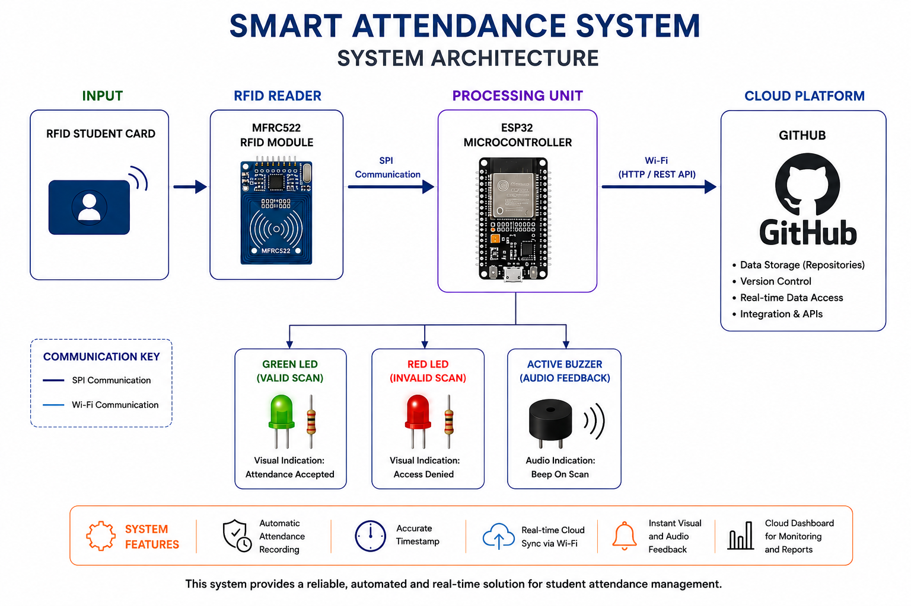

<h3>Design Decisions</h3>

- ESP32 was selected as the main controller because it supports both RFID communication and built-in Wi-Fi connectivity.
- MFRC522 RFID module was chosen for fast and contactless student identification.
- SPI communication was implemented between the ESP32 and RFID module for reliable data transfer.
- LEDs and a buzzer were added to provide instant visual and audio feedback to users.
- GitHub was used for version control, documentation, and project management.
- The system was designed to support real-time attendance recording.
- Breadboard prototyping was used to simplify hardware testing and troubleshooting.
- The project was designed to be scalable for future classroom expansion.

---

<h2 align="center">🔧 Hardware Components</h2>

| Component | Description | Quantity | Purpose |
|---|---|---|---|
| ESP32 Development Board | Microcontroller with built-in Wi-Fi and Bluetooth | 1 | Main controller that processes RFID data and controls peripherals |
| MFRC522 RFID Module | 13.56 MHz RFID reader using SPI communication | 1 | Reads student RFID cards and sends UID to ESP32 |
| RFID Student Cards / Tags | Passive RFID cards | Multiple | Used by students to register attendance |
| Green LED | 5mm LED | 1 | Indicates successful scan |
| Red LED | 5mm LED | 1 | Indicates failed or invalid scan |
| Active Buzzer | Audio feedback component | 1 | Produces sound during scans |
| 220Ω Resistors | Current limiting resistors | 2 | Protects LEDs from excessive current |
| Jumper Wires | Connection wires | Multiple | Connect components together |
| Breadboard | Prototyping board | 1 | Temporary circuit assembly |
| Enclosure Casing | Protective housing | 1 | Protects final hardware system |

---

<h2 align="center">💻 Software & Technologies</h2>

| Tool / Platform | Purpose |
|---|---|
| Arduino IDE | Firmware development and ESP32 programming |
| GitHub | Version control and project documentation |
| Wokwi | Online circuit simulation and testing |
| C++ | Programming language for ESP32 firmware |
| ESP32 Wi-Fi Library | Wireless communication |
| MFRC522 Library | RFID reader communication |

---

<h2 align="center">🔌 Circuit Diagram / Wiring</h2>

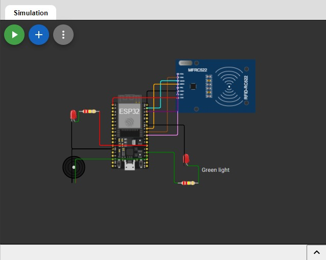

| Component Pin | Microcontroller Pin | Notes |
|---|---|---|
| MFRC522 SDA (SS) | GPIO 5 | SPI Slave Select pin |
| MFRC522 SCK | GPIO 18 | SPI Clock |
| MFRC522 MOSI | GPIO 23 | SPI Master Out Slave In |
| MFRC522 MISO | GPIO 19 | SPI Master In Slave Out |
| MFRC522 RST | GPIO 22 | RFID Reset pin |
| MFRC522 VCC | 3.3V | RFID module powered from ESP32 |
| MFRC522 GND | GND | Common ground |
| Green LED (+) | GPIO 13 | Use 220Ω resistor in series |
| Green LED (-) | GND | Ground connection |
| Red LED (+) | GPIO 12 | Use 220Ω resistor in series |
| Red LED (-) | GND | Ground connection |
| Buzzer (+) | GPIO 14 | Active buzzer for scan feedback |
| Buzzer (-) | GND | Common ground |

---

<h2 align="center">🏭 Build Process (with photos)</h2>

<h3>Step 1: Install ESP32 to Breadboard</h3>

> Inserted the ESP32 development board into the breadboard for the main hardware setup.

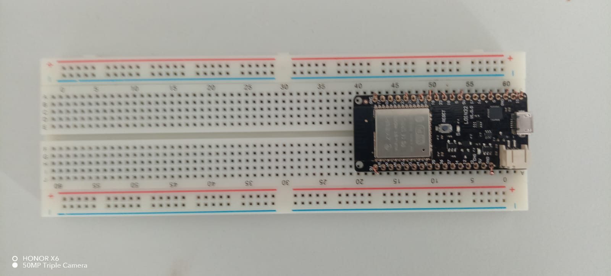

---

<h3>Step 2: Install MFRC522 RFID Scanner</h3>

> Mounted the MFRC522 RFID module onto the breadboard.

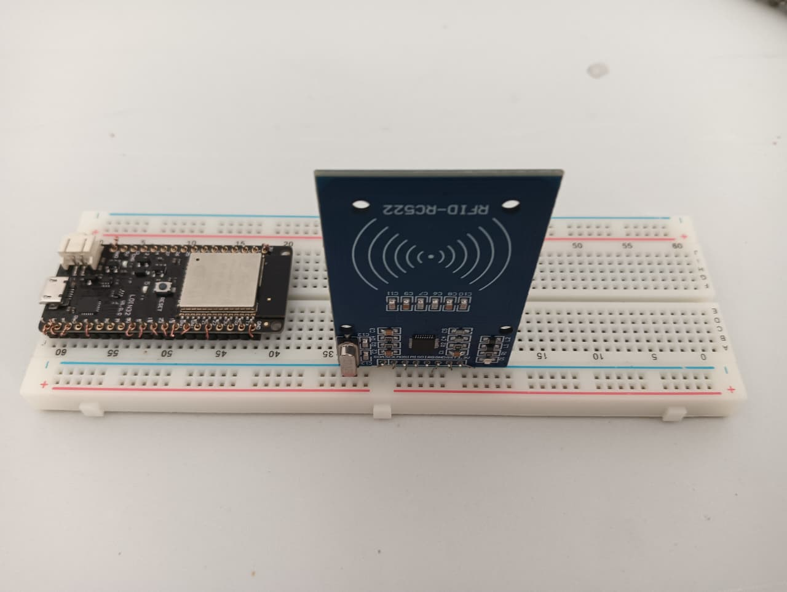

---

<h3>Step 3: Connect ESP32 to RFID Scanner</h3>

> Connected SPI communication pins between ESP32 and MFRC522 module.

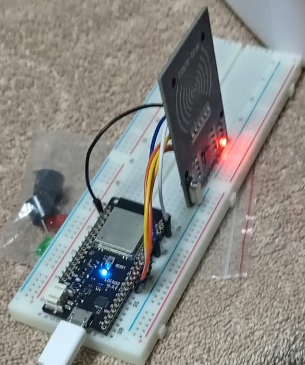

---

<h3>Step 4: Install Green LED</h3>

> Connected the green LED with a 220Ω resistor for successful scan indication.

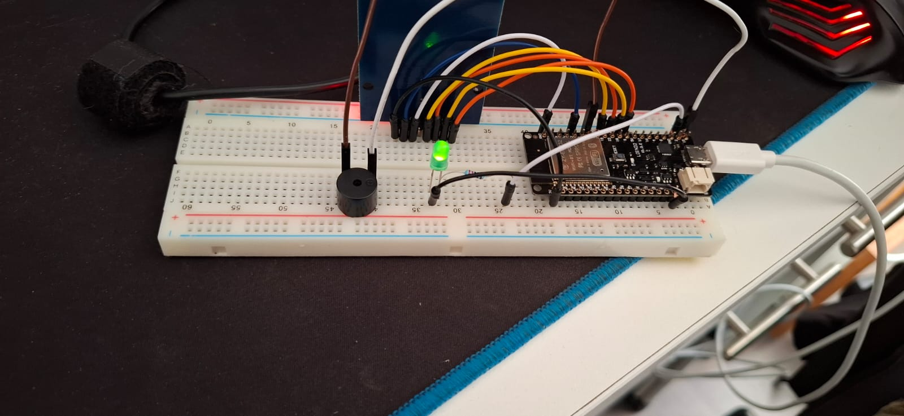

---

<h3>Step 5: Install Red LED</h3>

> Connected the red LED with a 220Ω resistor for invalid scan indication.

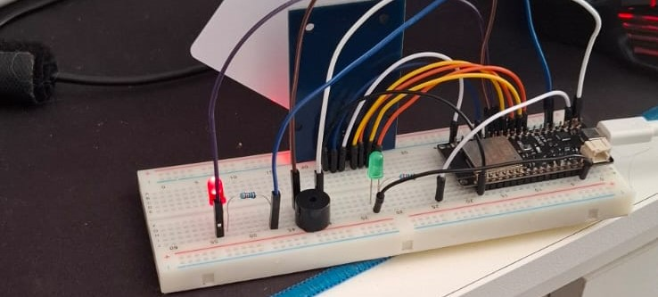

---

<h3>Step 6: Mount the Buzzer</h3>

> Installed the active buzzer for audio feedback during scans.

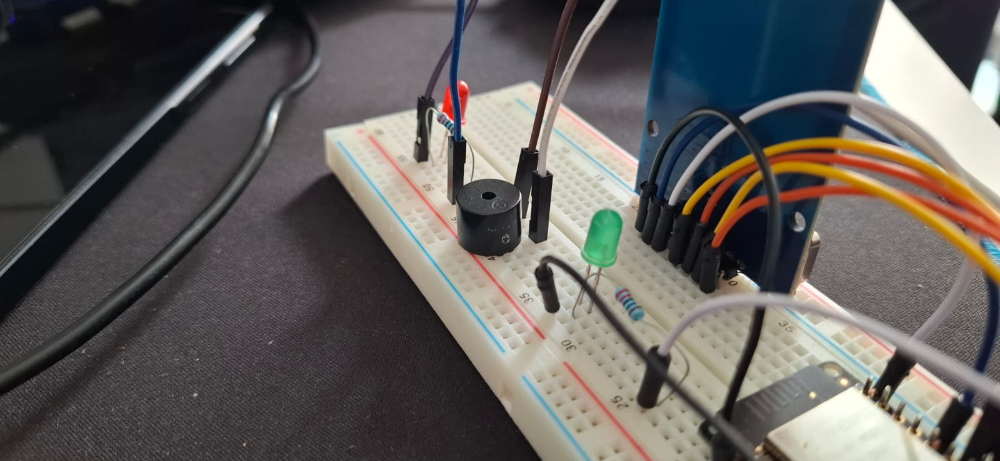

---

<h3>Step 7: Test Hardware Connections</h3>

> Verified all hardware connections and checked for communication errors.

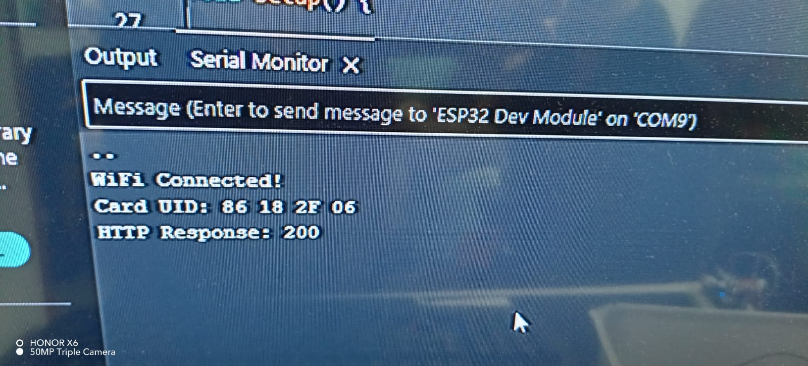

---

<h3>Step 8: Upload Firmware to ESP32</h3>

> Uploaded the attendance system firmware using Arduino IDE.

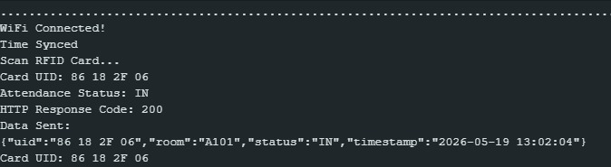

---

<h3>Step 9: Final Hardware Setup</h3>

> Completed final hardware assembly and enclosure installation.

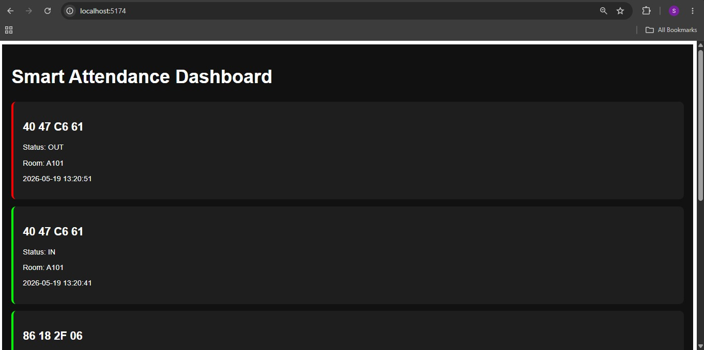

---

<h2 align="center">🖥️ Code Documentation</h2>

<h3>Main Firmware (`main.ino`)</h3>

<h3>Key Functions</h3>

| Function Name | Description |

---

<h2 align="center">🧪 Testing & Results</h2>

| Test # | Description | Expected Result | Actual Result | Pass/Fail |
|---|---|---|---|---|
| 1 | ESP32 powers on and connects to system | ESP32 initializes successfully | ESP32 booted successfully after first restart attempt | ✅ Pass |
| 2 | MFRC522 RFID scanner detects RFID card | RFID card detected within 2 seconds | Initial scan delay of 3 seconds, then successful detection | ✅ Pass |
| 3 | RFID data transmission to ESP32 | UID transmitted accurately | First read returned incomplete UID, second read successful | ✅ Pass |
| 4 | Green LED indication for valid card | Green LED lights up on authorized scan | LED flickered briefly before remaining stable | ✅ Pass |
| 5 | Red LED indication for invalid card | Red LED lights up on unauthorized scan | Worked correctly after resistor connection adjustment | ✅ Pass |
| 6 | Active buzzer audio feedback | Buzzer sounds during scan | Sound volume was initially low, corrected after rewiring | ✅ Pass |
| 7 | 220Ω resistor protection for Green LED | LED brightness controlled safely | No overheating detected during testing | ✅ Pass |
| 8 | 220Ω resistor protection for Red LED | Stable LED operation | Minor flicker observed initially, later stabilized | ✅ Pass |
| 9 | SPI communication between ESP32 and MFRC522 | Continuous communication without interruption | Temporary communication timeout occurred once, auto-recovered | ✅ Pass |
| 10 | Full attendance system operation | All components operate together correctly | System completed scans and feedback successfully after minor troubleshooting | ✅ Pass |

---

<h2 align="center">⚠️ Challenges & Solutions</h2>

| Challenge Encountered | Solution Applied |
|---|---|
| ESP32 crashing during startup due to code error | Debugged and corrected faulty code logic in Arduino IDE |
| MFRC522 RFID scanner not detecting cards | Rechecked SPI wiring connections and corrected misplaced pins |
| RFID reader giving inconsistent scans | Added delays and improved scan handling logic |
| Red LED not turning on properly | Fixed loose jumper wire connection and verified GPIO pin assignment |
| Green LED flickering during scans | Added proper 220Ω resistor and stabilized power connection |
| Active buzzer producing weak sound | Corrected buzzer polarity and updated output timing |
| ESP32 failing to upload code | Selected correct COM port and ESP32 board configuration |

---

<h2 align="center">🎥 Project Demonstration</h2>

- 📹 **Demo Video:** [Insert link here]  
- 📊 **Presentation Slides:** [Insert link here]  
- 🔗 **GitHub Repository:** [Insert link here]  

---

<h2 align="center">📚 References</h2>

1. [ESP32 Documentation](https://docs.espressif.com/projects/esp-idf/en/latest/esp32/) — Official ESP32 documentation  
2. [MFRC522 RFID Library](https://github.com/miguelbalboa/rfid) — RFID library for Arduino and ESP32  
3. [Arduino IDE](https://www.arduino.cc/en/software) — Arduino development environment  
4. [Wokwi](https://wokwi.com/) — Online IoT simulation and circuit testing platform  

---

## 📊 Assessment Rubric

> ⚠️ **Students: Do NOT modify this section.**

### 📝 T1 — 50 Marks

| Criteria | Excellent (5) | Good (4) | Satisfactory (3) | Needs Improvement (2) | Incomplete (0-1) | Marks |
|---|---|---|---|---|---|---|
| Project Proposal & Problem Statement | Clear, detailed, well-researched | Clear with minor gaps | Stated but lacks depth | Vague | Not submitted | /5 |
| System Design & Architecture | Detailed diagram + design decisions | Good diagram with some docs | Basic diagram | Incomplete | Not submitted | /5 |
| Hardware Component Selection | All justified with images | Most documented | Listed not justified | Incomplete | Not attempted | /5 |
| Circuit Diagram / Wiring | Complete + pin mapping | Mostly complete | Partial | Incomplete | Not submitted | /5 |
| GitHub Repository Setup | Well-structured, clear commits | Good with minor issues | Basic structure | Minimal | Repo not set up | /5 |
| Markdown Documentation Quality | Excellent: headings, tables, images, code | Good with minor issues | Basic Markdown | Minimal | None | /5 |
| GitHub Commit History (T1) | Regular commits, all members | Regular, most members | Some commits | Few | None | /5 |
| Initial Code / Prototype | Working + well-commented | Working + some comments | Partial prototype | Started, not working | None | /5 |
| Group Collaboration Evidence | Issues, PRs, commits from all | Good evidence | Some evidence | Minimal | None | /5 |
| Build Progress Photos | Step-by-step + descriptions | Good photos | Photos, few descriptions | Few photos | None | /5 |
| | | | | | **T1 Total** | **/50** |

---

### 📝 T2 — 50 Marks *(Final Presentation: End of April 2026)*

| Criteria | Excellent (5) | Good (4) | Satisfactory (3) | Needs Improvement (2) | Incomplete (0-1) | Marks |
|---|---|---|---|---|---|---|
| Final Working Project | Fully functional | Mostly functional | Partially functional | Limited functionality | Not functional | /5 |
| Live Demonstration | Confident, all features | Good, minor issues | Core features shown | Partial/unclear | No demonstration | /5 |
| Testing & Results Documentation | All tests + analysis | Most documented | Some documented | Minimal | None | /5 |
| Code Quality & Comments | Clean, structured, fully commented | Good, most commented | Works, lacks comments | Messy/partial | None | /5 |
| Markdown Documentation Quality (T2) | Complete professional README | Good with minor gaps | Most sections filled | Incomplete | Minimal/none | /5 |
| GitHub Commit History (T2) | Consistent, all members | Good, most members | Some commits | Few | None | /5 |
| Challenges & Solutions | All documented with solutions | Most documented | Some documented | Vague | Not documented | /5 |
| System Architecture (Final) | Updated, matches build | Mostly matches | Partially updated | Outdated | Not present | /5 |
| Presentation Quality | Professional, all members | Good, all contribute | Acceptable | Weak/incomplete | None | /5 |
| References & Attribution | All properly listed | Most listed | Some listed | Minimal | None | /5 |
| | | | | | **T2 Total** | **/50** |

---

### 🏆 Final Mark Summary

| Term | Marks Available | Marks Achieved |
|---|---|---|
| T1 | 50 | /50 |
| T2 | 50 | /50 |
| **Total** | **100** | **/100** |

---

> 📌 **Assessed by:** `[Lecturer Name]`  
> 📅 **Final Submission Deadline:** End of April 2026  
> 🏫 **Institution:** Cape Peninsula University of Technology (CPUT)

---

*Documented using Markdown on GitHub — CPUT IT Diploma IoT Elective 2026* 🚀
